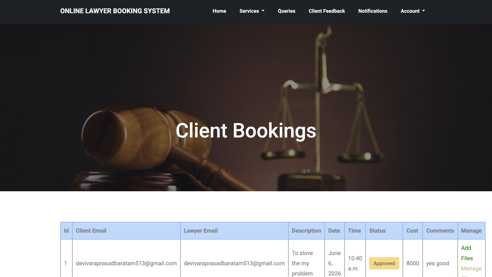
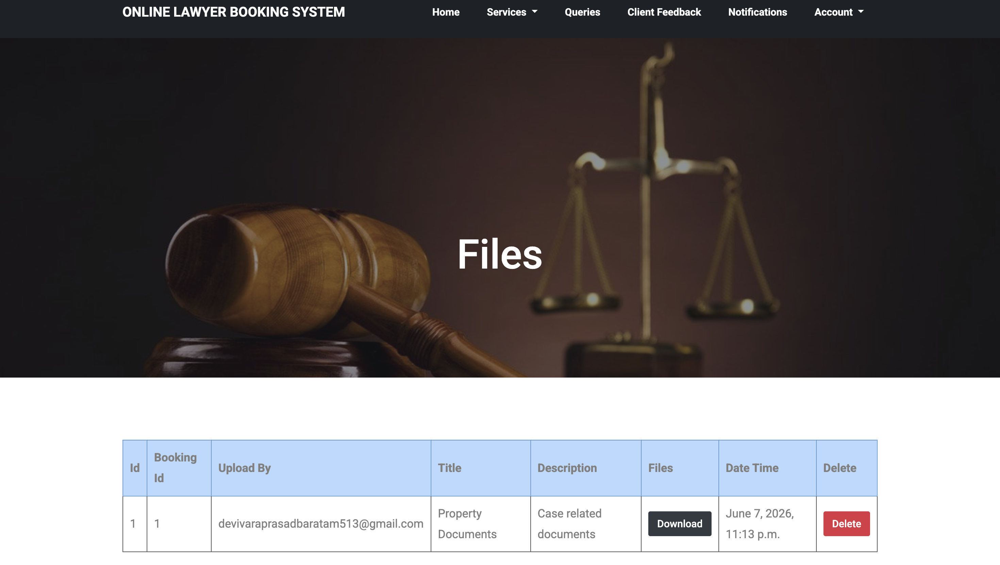
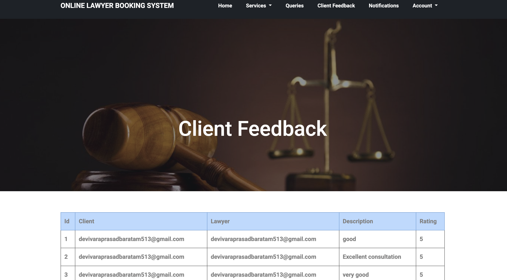

# Online Lawyer Booking System

## Overview

The Online Lawyer Booking System is a web-based application developed using Django and MySQL. The system provides an online platform where clients can search lawyers, book appointments, access legal services, upload and download documents, submit queries, and provide feedback. Lawyers can manage bookings, services, files, and client communication. Administrators can manage the overall system.

---

## Features

### Admin Module
- Admin Login
- View Clients
- View Lawyers
- Add Notifications
- View Notifications

### Lawyer Module
- Lawyer Registration & Login
- Manage Profile
- View Client Bookings
- Approve / Reject Bookings
- Add Legal Services
- Upload Case Files
- Reply to Queries
- View Feedback

### Client Module
- Client Registration & Login
- Search Lawyers
- Book Lawyers
- Book Services
- Download Files
- Submit Queries
- Provide Feedback
- View Notifications

---

## Technologies Used

- Python
- Django
- MySQL
- HTML
- CSS
- Bootstrap
- JavaScript
- PyCharm

---

## Database Tables

- client
- lawyer
- book_lawyer
- services
- add_feedback
- add_queries
- notifications
- manage

---

## System Architecture

Client Browser

↓

Django Application

↓

MySQL Database

---

## Screenshots

### Home Page


### Client Lawyers


### Client Bookings


### Lawyer Dashboard


### View Bookings



### Manage Files



### Feedback Page



### Admin Dashboard


---

## Installation

### Clone Repository

```bash
git clone https://github.com/devivaraprasadbaratam-cpu/Online-Lawyer-Booking-System.git
```

### Navigate to Project Folder

```bash
cd Online-Lawyer-Booking-System
```

### Install Dependencies

```bash
pip install -r requirements.txt
```

### Run Migrations

```bash
python manage.py migrate
```

### Start Server

```bash
python manage.py runserver
```

---

## Project Modules

### Admin
Manages lawyers, clients, and notifications.

### Lawyer
Handles bookings, services, file uploads, and client communication.

### Client
Books lawyers, downloads files, submits feedback, and raises queries.

---

## Author

**Devi Vara Prasad Baratam**

GitHub Profile:

https://github.com/devivaraprasadbaratam-cpu